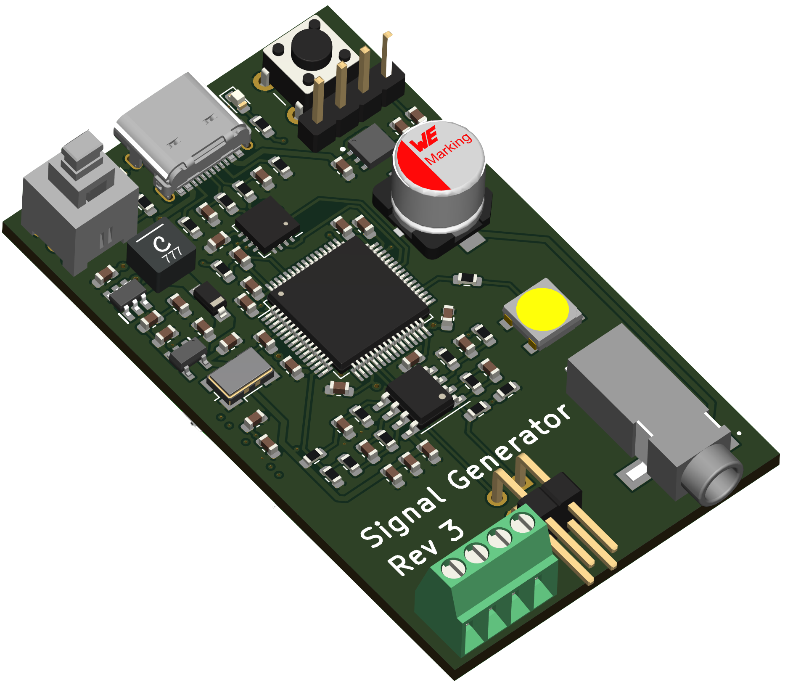
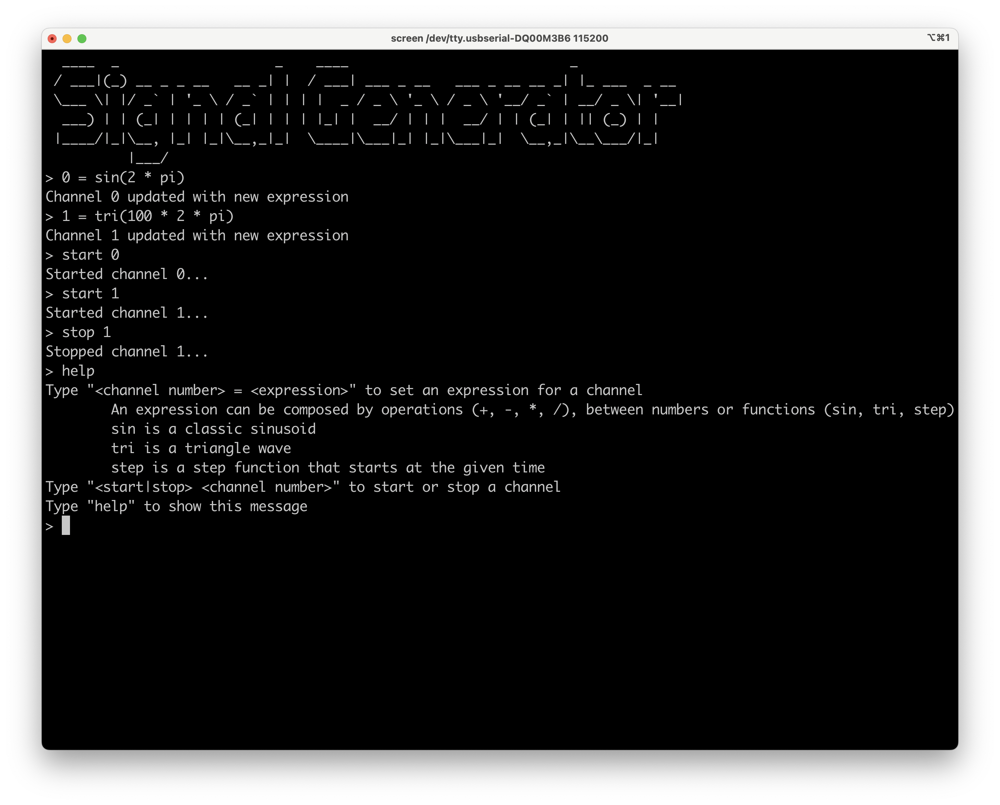
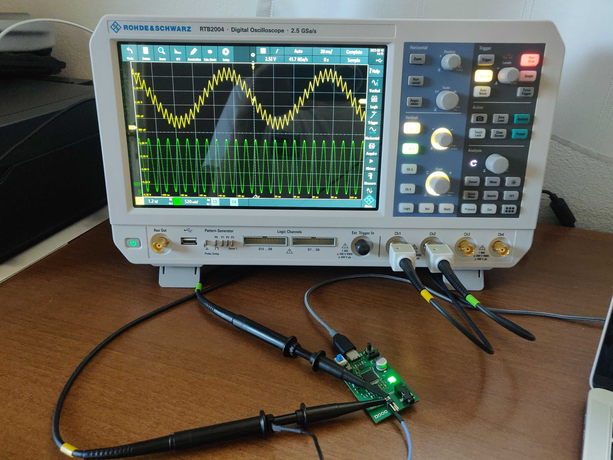

# Signal Generator with an STM32

## Introduction

The main idea of this project is to develop a waveform generator instrument using an STM32 microcontroller and its built-in DAC. The project has 2 parts:
\begin{itemize}
- **Software**: The application needs to showcase the STM32 capability to output
            waveforms  at sample rates of 100kHz or greater. The software has to include a
            peripheral driver to access the built in DAC using DMA.
- **Hardware**: The device has to to implement a waveform generator output stage
            circuitry that allows to extend the capabilities of the built in DAC.

To achieve this goals a custom board was designed and software drivers were developed for the DAC and DMA. The final product also includes a text interface where the user can setup an arbitrary waveform and the device parses the user input using Flex and Bison.

    
    

## Analog Front End

The stm32 incorporates a Digital-to-Analog Converter (DAC) with an integrated output buffer. When enabled, the buffer allows the DAC to drive external loads directly. However, this comes at the cost of limited driving capability, especially when interfacing with capacitive loads. Disabling the buffer offers a pure analog output, but necessitates an external buffer or amplifier to drive any meaningful external load. The inherent impedance of the DAC's output pin can also cause distortions and constrain the signal's frequency, particularly when dealing with capacitive loads.

Integrating an external operational amplifier (op-amp) into the analog front-end offers multiple advantages:

- **Buffering DAC Output**: The op-amp serves as a buffer, isolating the DAC from the actual load. This setup minimizes the effects of the DAC output pin's impedance, enabling the DAC to operate in a near-ideal environment.
- **Voltage Scaling**: Configured in a non-inverting amplifier mode, the op-amp provides adjustable gain, facilitating flexible signal amplitude adjustments.

Given that the board is powered via USB, which typically provides 5V, there's a need to step up this voltage to achieve the 12V requirement for the analog front end:

- **Boost Converter**: The TLV61048 boost converter is employed to step up the USB's 5V to 13.12V.
- **Linear Voltage Regulator**: Following the boost converter, an LDO is used to convert the 13.12V from the boost converter to a stable 12V output. This stable 12V supply is crucial to ensure that the analog front-end, especially the operational amplifier, operates with consistency.

The opamp circuit also features a voltage divider to feedback the output signal to the STM32's ADC. This could allow the microcontroller to perform automatic calibration of the opamp gains.
Here's the provided LaTeX content converted into markdown:

## Microcontroller and digital domain

The STM32F205 is a low-end microcontroller with a 120MHz clock speed, 128KB of RAM, and the required peripherals needed by the project (DAC, DMA, and timers). It was used mainly because it was already stocked in the lab.

The board also features:
- An external 25MHz crystal oscillator to drive the microcontroller.
- A USB to UART bridge to allow the user to interact with the device via a serial terminal.
- An RGBW addressable led used for status indication.
- A header connector that exposes the SWD programming interface.
- Two buttons: one for reset and one for the BOOT0 pin.
- A microSD card slot to store files.

## Software architecture

The software powering the signal generator board is built upon the [Miosix operating system](https://github.com/NidasioAlberto/miosix-kernel) and features 2 main components:
- Drivers for the DAC and DMA peripherals.
- A parser built using Flex and Bison that allows interpreting the user input into arbitrary math functions used to generate the output waveform.

### Peripherals drivers

The STM32F205 microcontroller is equipped with a versatile Digital-to-Analog Converter (DAC) peripheral that offers 12-bit resolution and two separate channels, effectively incorporating two DACs. This dual-channel architecture permits simultaneous generation of two distinct analog outputs, allowing our custom board to feature two independent output channels.

The DAC's conversion process can be initiated through multiple methods. It can be triggered manually via software, which provides direct control over the conversion timing. Alternatively, for applications requiring precise and periodic analog outputs, external triggers can be employed. A common external trigger source is a timer, which can initiate DAC conversions at predetermined intervals, ensuring consistent waveform generation.

The STM32's DAC is also designed with the capability to generate DMA requests. Once the DAC is ready for new data, it can signal the DMA peripheral to fetch the next data sample. The DMA (Direct Memory Access) controller is a powerful tool designed to handle data transfers independently of the CPU's operation. This peripheral is characterized by sixteen independent streams, each of which can be paired with different peripherals, granting a wide range of configuration possibilities. By leveraging the DMA's rapid data transfer capabilities, the DAC can be persistently supplied with data while leaving the CPU time to generate new data samples or perform other tasks.

One of its standout features is the double buffering mode. This mode uses two memory pointers: while one buffer is actively engaged by the DMA stream, the other can be prepared by the CPU, ensuring uninterrupted data flow.

In the context of the signal generator project, the DMA plays a crucial role. Each DAC is set up to utilize an external trigger originating from a timer. With every trigger event, the DAC issues a DMA request for a new data sample. The DMA has been configured in double buffer mode. Alternatively, a single buffer mode combined with the half-transfer interrupt could have been adopted to achieve a similar result. This integration of the DAC with the DMA and a timer is what ultimately powers the project's ability to generate high-frequency waveforms even with a low-end microcontroller such as the STM32F205.

The developed drivers are C++ classes that abstract the peripherals and allow the programmer to easily configure and use them. In particular, the DMA driver is divided into two classes and one struct:
- **DMADriver**: A singleton that manages all DMA streams. When a piece of code needs a stream, it can request it to the DMADriver. If the stream is already in use, the DMADriver will pause the thread until the stream is available, otherwise, it will acquire the stream and return it to the caller.
- **DMATransaction**: A struct that holds all configuration parameters for a specific transfer. This includes source and destination addresses, data size, double buffer, interrupts, and so on.
- **DMAStream**: This class allows configuring the stream for a specific transaction, start and stop it, and easily handle interrupts. In particular, interrupts can be waited for with or without a timeout (thanks to the Miosix's timed wait feature) or registering a callback function that will be called when the interrupt occurs.

# Project outcomes

## Concrete outcomes

The project achieved two concrete outcomes:
- **Electronic board**: The board was designed and assembled successfully. It includes an analog front end that extends the capabilities of the STM32's built-in DAC and also includes features, such as the ADC feedback and micro SD, that allows further experimentation.
- **Software drivers**: Two software drivers were developed, one for the DAC and one for the DMA. These allow the use of the peripherals in a simple and efficient way.

## Learning outcomes

Developing both the hardware and the software allowed me not only to learn about the STM32 microcontroller and its peripherals but also to learn about the whole process of designing and assembling a PCB.

Particular effort went into the design of the board itself, selecting and sourcing the components, and manually assembling the board. It was a challenge because, being my first time creating a complex PCB with a microcontroller, I was not well prepared. I had to learn about the different types of components, which were required for my design, and which not. Some special takeaways were the importance of reading carefully the components datasheet, finding application notes to understand similar projects, and learning how to design and order a PCB (with KiCad and JLCPCB).

The assembly of the board was the most exciting part because I got to see my design come to life. I procured the necessary soldering equipment (solder paste, a hot plate, a hot air gun, and a microscope) and I soldered the board first by distributing the solder paste with a stencil and then by heating the board with the hot plate for the top layer, and with the hot air gun for the bottom layer. I had to learn how to use the equipment and how to solder the different components.

The software side was instead more akin to my previous experiences. I had already worked with microcontrollers and already used the Miosix operating system. However, I had never worked with the DMA peripheral. The most challenging aspects were understanding how the peripherals work by reading the reference manual and also finding examples online which are hard to come by.

## Existing knowledge

The most useful knowledge that helped me in this project came from 3 sources:
- **Advanced Operating System**: In particular, the parts on concurrency, thread programming, and analysis of the features in the Miosix operating system.
- **Embedded Systems**: The course gave me a good understanding of the development process of a microcontroller-based system, both for the design aspects and for the production processes involved.
- **Skyward Experimental Rocketry**: Most of the experience I had prior to this academic year was my involvement in the Skyward Experimental Rocketry team. Previously I was involved in the design and development of the software for the rocket. This year I also had the responsibility of managing the production of the avionic system as a whole, including the electronic part. This gave me a good opportunity to work on another project and the luck of knowing lots of talented teammates.

## Problems encountered

The worst setback I faced was the board redesign. In the first version, I used an STM32F103 which is a cheaper microcontroller that has no built-in DAC! I realized this only after I had assembled the board and tried to use it. I had to adjust the schematic and the PCB in order to use the STM32F205 instead and reorder the board.

Once the board was ready I faced other problems during the development of the drivers but I managed to solve them without major issues. In this process, the debugger was particularly useful to understand what was going on.
